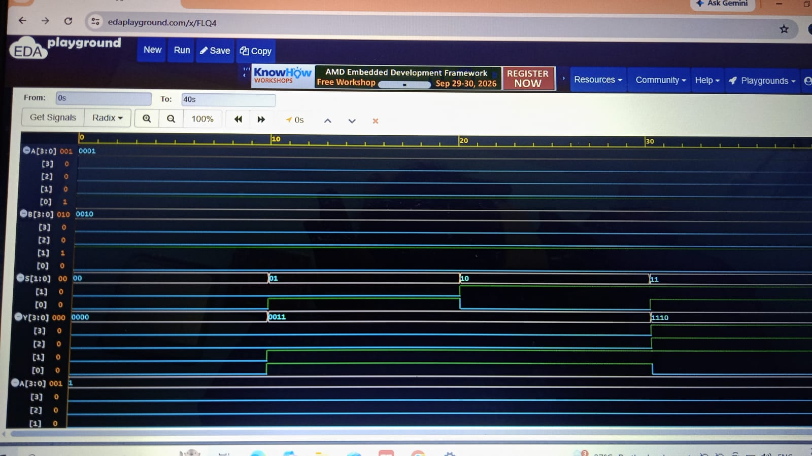

# 4-bit Logic Unit using Verilog HDL

## 📌 Project Overview

A 4-bit Logic Unit designed and simulated using Verilog HDL.

The Logic Unit performs four basic logical operations based on a 2-bit select input.

## ⚙️ Operations

| Select (S) | Operation | Output |
|------------|-----------|--------|
| 00 | AND | A & B |
| 01 | OR | A \| B |
| 10 | XOR | A ^ B |
| 11 | NOT | ~A |

## 🔌 Inputs and Output

- A: 4-bit input
- B: 4-bit input
- S: 2-bit select input
- Y: 4-bit output

## 🛠️ Tools Used

- Verilog HDL
- EDA Playground
- Icarus Verilog
- EPWave

## 🧪 Verification

A Verilog testbench was created to verify all four operations.

The design was simulated successfully and the output waveforms were analyzed using EPWave.

### Simulation Waveform

## 📂 Files

- `logic_unit_4bit.v` — Verilog design
- `tb_logic_unit_4bit.v` — Testbench

## 📚 What I Learned

- Verilog vectors
- Behavioral modeling
- `case` statements
- Testbench development
- Simulation and debugging
- Waveform analysis

## 🚀 Future Improvements

This project can be extended with additional arithmetic and logical operations to build a more advanced ALU.
